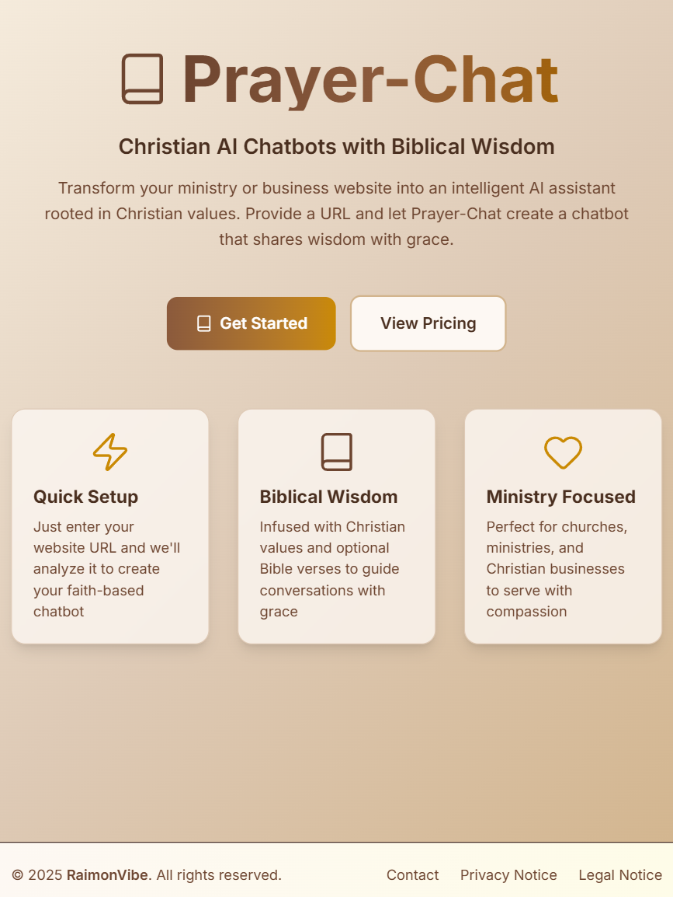

# 🙏  Prayer-Chat AI Chatbot Generator

**Live Demo:** [https://www.prayer-chat.com/](https://www.prayer-chat.com/)



An open-source AI-powered chatbot platform built with Java Spring AI that analyzes websites and creates intelligent conversational agents automatically. Built using modern RAG (Retrieval Augmented Generation) architecture with Spring AI, Anthropic Claude 3 Haiku, and vector embeddings.

> **Disclaimer**: This is an independent open-source project and is not affiliated with, endorsed by, or associated with Noupe, JotForm, or any other commercial chatbot service.

[Live Demo](https://www.prayer-chat.com/)

[](https://deepwiki.com/raimonvibe/chatbot-java-spring-ai)

## ✨ Features

### 🎯 Modern Frontend Dashboard
- **📊 Intuitive Dashboard**: Beautiful Next.js dashboard for managing all your chatbots
- **🚀 One-Click Creation**: Create chatbots with just a name, description, and website URL
- **👁️ Live Preview**: Test your chatbots in real-time with a full chat interface
- **📋 Embed Code Generator**: Get ready-to-use embed codes for your website
- **🎨 Modern UI**: Built with Next.js 15, Tailwind CSS, and Framer Motion for smooth animations
- **📱 Responsive Design**: Works perfectly on desktop, tablet, and mobile devices

### 🚀 Prayer-Chat Exclusive Features
- **⚡ Webhook Integration**: Send real-time conversation events to external systems (CRM, Slack, Discord, custom webhooks)
- **📊 Conversation Export**: Export chat history in JSON or CSV formats for analytics and reporting
- **💬 Quick Replies**: Configure suggested response buttons for common questions to improve UX
- **✝️ Christian Messaging**: Integrate Christian values, Bible verses, and blessings into chatbot responses based on website topics

### 🧠 AI-Powered Intelligence
- **Automatic Website Analysis**: Crawls and analyzes website content to build knowledge base
- **Vector Embeddings**: Uses advanced AI embeddings for semantic search and context retrieval
- **Retrieval Augmented Generation (RAG)**: Combines website content with AI for accurate responses
- **Multi-Language Support**: Supports 12+ languages with automatic detection

### 🎨 Customization & Branding
- **Custom Branding**: Match your brand with custom colors, fonts, and styling
- **Flexible Theming**: Multiple theme options and customizable appearance
- **Embeddable Widget**: Easy-to-integrate JavaScript widget for any website
- **Responsive Design**: Works perfectly on desktop and mobile devices

### 📊 Analytics & Monitoring
- **Conversation Tracking**: Track all user interactions and conversations
- **Performance Analytics**: Monitor response times and user engagement
- **Language Analytics**: Understand which languages your users prefer
- **Real-time Dashboard**: Comprehensive analytics dashboard

### 🔧 Advanced Features
- **Session Management**: Persistent conversations across page loads
- **Custom Prompts**: Add specific instructions for chatbot behavior
- **Website Crawling**: Intelligent web scraping with content filtering
- **Vector Store Integration**: Scalable vector database for content storage

## 🛠️ Tech Stack

### Backend
- **Java 21+** with Spring Boot 4.1
- **Spring AI** for AI integrations and RAG architecture
- **Anthropic Claude 3 Haiku** for conversational AI
- **Cohere** for multilingual embeddings (embed-multilingual-v3.0)
- **Spring Data JPA** with H2/PostgreSQL
- **Spring Security** with JWT authentication
- **WebFlux** for reactive HTTP clients

### Frontend
- **Next.js 15** with App Router
- **React 18** with TypeScript
- **Tailwind CSS** for styling
- **Framer Motion** for animations
- **RESTful API** integration

### AI & Vector Storage
- **Custom Cohere Integration** using HTTP API
- **Vector Embeddings** (1024 dimensions)
- **Optional Pinecone** for production vector storage
- **RAG Architecture** for accurate, context-aware responses

## 🚀 Quick Start

### Prerequisites

**Option 1: Docker (Recommended)**
- Docker 20.10+ and Docker Compose 2.0+
- Anthropic API key (for Claude AI chat)
- Cohere API key (for embeddings)
- Optional: Pinecone API key (for vector storage)

**Option 2: Local Development**
- Java 21 or higher
- Maven 3.6+
- Node.js 20+ and npm (for frontend)
- Anthropic API key (for Claude AI chat)
- Cohere API key (for embeddings)
- Optional: Pinecone API key (for vector storage)

### Installation

#### Option 1: Docker (Recommended)

The fastest way to get started:

```bash
# 1. Clone the repository
git clone <repository-url>
cd ai-chatbot-system

# 2. Copy and configure environment variables
cp .env.example .env
# Edit .env and add your API keys

# 3. Start all services
docker-compose up -d

# 4. Access the application
# - Frontend: http://localhost:3000
# - Backend API: http://localhost:8081
# - Database: PostgreSQL on localhost:5432
```

That's it! The entire stack is now running.

#### Option 2: Local Development

1. **Clone the repository**
   ```bash
   git clone <repository-url>
   cd ai-chatbot-system
   ```

2. **Configure environment variables**

   Create a `.env` file in the root directory:
   ```bash
   ANTHROPIC_API_KEY=your-anthropic-api-key-here
   COHERE_API_KEY=your-cohere-api-key-here
   JWT_SECRET=your-secret-key-here
   PINECONE_API_KEY=your-pinecone-api-key-here  # Optional
   PINECONE_ENVIRONMENT=your-pinecone-environment  # Optional
   ```

3. **Run the backend**
   ```bash
   cd backend
   mvn spring-boot:run
   ```
   Backend will start on http://localhost:8081

4. **Run the frontend**
   ```bash
   cd frontend
   npm install
   npm run dev
   ```
   Frontend will start on http://localhost:3000

5. **Access the application**
   - Frontend Dashboard: http://localhost:3000
   - Backend API: http://localhost:8081
   - H2 Console: http://localhost:8081/h2-console

## 📖 Usage Guide

### Creating Your First Chatbot

1. **Access the Dashboard**
   - Navigate to http://localhost:3000
   - You'll see the Prayer-Chat homepage
   - Click "Dashboard" or "Go to Dashboard to create your first chatbot"

2. **Create a New Chatbot**
   - Click "Create New Chatbot" button
   - Fill in the form:
     - **Name**: Give your chatbot a name (e.g., "Support Assistant")
     - **Description**: Describe what your chatbot does
     - **Website URL**: Enter your website URL (e.g., https://example.com)
   - Click "Create Chatbot"

3. **Automatic Website Analysis**
   - The system automatically starts analyzing your website
   - It crawls pages, extracts content, and creates embeddings
   - This process may take a few minutes depending on your website size

4. **Preview Your Chatbot**
   - From the dashboard, click "Preview Chatbot" on your chatbot card
   - Test the chatbot by asking questions about your website
   - The chatbot will use the analyzed content to provide accurate answers
   - Quick replies (if configured) will appear below the chat

5. **Get Embed Code**
   - Click "Get Embed Code" on your chatbot card
   - Copy the provided HTML/JavaScript code
   - Paste it into your website's HTML
   - The chatbot widget will appear on your site

6. **Manage Multiple Chatbots**
   - Create different chatbots for different websites or purposes
   - Each chatbot has its own knowledge base and configuration
   - Switch between chatbots from the dashboard

### API Endpoints

#### Chatbot Management
```bash
# Get all chatbots
GET /api/chatbots

# Create new chatbot
POST /api/chatbots
{
  "name": "My AI Assistant",
  "websiteUrl": "https://example.com",
  "description": "AI assistant for my website",
  "primaryLanguage": "en",
  "supportedLanguages": ["en", "es", "fr"]
}

# Update chatbot
PUT /api/chatbots/{id}

# Delete chatbot
DELETE /api/chatbots/{id}

# Analyze website
POST /api/chatbots/{id}/analyze

# Index content
POST /api/chatbots/{id}/index

# Get analytics
GET /api/chatbots/{id}/analytics
```

#### Chat API
```bash
# Send message to chatbot
POST /api/chat/{chatbotId}
{
  "message": "What services do you offer?",
  "sessionId": "session_123",
  "language": "en"
}

# Get chatbot by embed code
GET /api/chat/embed/{embedCode}
```

#### 🚀 NEW: Conversation Export API
```bash
# Export single conversation to JSON
GET /api/chatbots/conversations/{conversationId}/export/json

# Export single conversation to CSV
GET /api/chatbots/conversations/{conversationId}/export/csv

# Export all chatbot conversations to JSON
GET /api/chatbots/{id}/export/json

# Export all chatbot conversations to CSV
GET /api/chatbots/{id}/export/csv
```

#### 🚀 NEW: Quick Replies API
```bash
# Get quick replies for a chatbot
GET /api/chatbots/{id}/quick-replies

# Update chatbot with quick replies (in update request)
PUT /api/chatbots/{id}
{
  "quickReplies": "[{\"text\": \"What are your hours?\", \"value\": \"hours\"}, {\"text\": \"Pricing info\", \"value\": \"pricing\"}]"
}
```

#### 🚀 NEW: Webhook Configuration
```bash
# Configure webhook in chatbot update
PUT /api/chatbots/{id}
{
  "webhookUrl": "https://your-app.com/webhook",
  "webhookEvents": ["conversation_started", "message_sent", "conversation_ended"]
}

# Webhook payload structure (sent to your URL):
{
  "event": "conversation_started",
  "chatbot_id": 1,
  "chatbot_name": "My Chatbot",
  "timestamp": 1698765432000,
  "data": {
    "conversation_id": 123,
    "user_ip": "192.168.1.1",
    "language": "en",
    "created_at": "2024-01-01T12:00:00"
  }
}
```

#### ✝️ NEW: Christian Messaging API
```bash
# Suggest Bible verse based on website topic
POST /api/chatbots/{id}/suggest-bible-verse

# Response:
{
  "chatbotId": "1",
  "suggestedVerse": "Proverbs 16:3 - 'Commit to the Lord whatever you do, and he will establish your plans.'",
  "autoApplied": "true"
}

# Update chatbot with Christian messaging
PUT /api/chatbots/{id}
{
  "christianMessagingEnabled": true,
  "bibleVerse": "Matthew 5:16 - 'Let your light shine before others, that they may see your good deeds and glorify your Father in heaven.'"
}
```

**Christian Messaging Features:**
- Automatically suggests relevant Bible verses based on website topic (30+ categories)
- Includes Christian values in chatbot personality (love, kindness, compassion)
- Adds faith-based greetings for first-time visitors
- Incorporates blessings in response footers
- Supports topics: business, healthcare, education, technology, hospitality, finance, and more
- Can be enabled/disabled per chatbot

## 🛠️ Configuration

### Application Properties

```yaml
# AI Configuration
spring:
  ai:
    # Anthropic Claude for chat
    anthropic:
      api-key: ${ANTHROPIC_API_KEY}
      chat:
        options:
          model: claude-3-haiku-20240307
          temperature: 0.7
          max-tokens: 1000

    # Cohere for embeddings
    cohere:
      api-key: ${COHERE_API_KEY}
      embedding:
        options:
          model: embed-multilingual-v3.0

# Website Analysis Settings
app:
  website-analysis:
    max-pages: 50
    max-depth: 3
    timeout-seconds: 30
    user-agent: "AI-Chatbot-Crawler/1.0"

# Chatbot Settings
app:
  chatbot:
    max-conversation-history: 10
    default-language: en
    supported-languages: en,es,fr,de,it,pt,ru,zh,ja,ko
```

### Database Configuration

The application uses H2 database by default for development. For production, configure PostgreSQL:

```yaml
spring:
  datasource:
    url: jdbc:postgresql://localhost:5432/chatbot_db
    username: your-username
    password: your-password
    driver-class-name: org.postgresql.Driver
```

## 🎨 Customization

### Branding Configuration

Customize your chatbot's appearance using JSON configuration:

```json
{
  "primaryColor": "#007bff",
  "secondaryColor": "#6c757d",
  "fontFamily": "Arial, sans-serif",
  "borderRadius": "8px",
  "buttonStyle": "rounded"
}
```

### Custom Prompts

Add specific instructions for your chatbot:

```
You are a helpful AI assistant for [Your Company Name].
- Always be friendly and professional
- Focus on helping customers with product information
- If you don't know something, suggest contacting support
- Use a conversational tone
```

## 📊 Analytics Dashboard

The system provides comprehensive analytics:

- **Conversation Metrics**: Total conversations, active sessions
- **Performance Stats**: Average response time, message counts
- **Language Distribution**: Which languages users prefer
- **Website Analysis**: Content extraction statistics
- **User Engagement**: Conversation duration and patterns

## 🔧 Advanced Features

### Vector Store Integration

For production deployments, configure Pinecone for scalable vector storage:

```yaml
spring:
  ai:
    vectorstore:
      pinecone:
        api-key: ${PINECONE_API_KEY}
        environment: ${PINECONE_ENVIRONMENT}
        index-name: chatbot-vectors
        namespace: default
```

### Multi-Language Support

The system automatically detects user language and responds appropriately:

- **Automatic Detection**: Uses browser language settings
- **Manual Override**: Users can select preferred language
- **Fallback Support**: Defaults to English if language not supported

### Website Analysis

Advanced web crawling features:

- **Smart Content Extraction**: Removes navigation, ads, and irrelevant content
- **Depth Control**: Configurable crawling depth
- **Content Filtering**: Skips binary files and irrelevant pages
- **Language Detection**: Automatically detects page language

## 🚀 Deployment

### Docker Deployment (Recommended)

#### Using Docker Compose (Local Development)

The easiest way to run the entire stack locally:

```bash
# 1. Copy environment variables
cp .env.example .env
# Edit .env and add your API keys

# 2. Start all services (PostgreSQL, Backend, Frontend)
docker-compose up -d

# 3. View logs
docker-compose logs -f

# 4. Stop all services
docker-compose down
```

This will start:
- PostgreSQL database on `localhost:5432`
- Backend API on `localhost:8081` (for local development without Docker, use 8081)
- Frontend dashboard on `localhost:3000`

**Note**: When using Docker Compose, the backend runs on port 8080 internally. For local development without Docker, the backend runs on port 8081.

#### Building Individual Services

**Backend:**
```bash
cd backend
docker build -t prayer-chat-backend .
docker run -p 8081:8081 \
  -e ANTHROPIC_API_KEY=your-key \
  -e COHERE_API_KEY=your-key \
  -e JWT_SECRET=your-secret \
  prayer-chat-backend
```

**Frontend:**
```bash
cd frontend
docker build -t prayer-chat-frontend .
docker run -p 3000:3000 \
  -e NEXT_PUBLIC_API_URL=http://localhost:8081 \
  prayer-chat-frontend
```

### Deploying to Render

This project includes a `render.yaml` file for easy deployment to Render:

#### One-Click Deploy

1. **Fork this repository** to your GitHub account

2. **Sign up for Render** at https://render.com

3. **Create a New Blueprint Instance**
   - Go to https://dashboard.render.com/blueprints
   - Click "New Blueprint Instance"
   - Connect your GitHub repository
   - Select the forked repository

4. **Configure Environment Variables**

   Render will automatically create the services. Set these environment variables in the Render dashboard:

   **Backend Service:**
   - `ANTHROPIC_API_KEY` - Your Anthropic API key
   - `COHERE_API_KEY` - Your Cohere API key
   - `PINECONE_API_KEY` - Your Pinecone API key (optional)
   - `PINECONE_ENVIRONMENT` - Your Pinecone environment (optional)
   - `PINECONE_INDEX_NAME` - Your Pinecone index name (default: chatbot-vectors)
   - `GOOGLE_CLIENT_ID` - For Google OAuth (optional)
   - `GOOGLE_CLIENT_SECRET` - For Google OAuth (optional)
   - `STRIPE_SECRET_KEY` - For payments (optional)
   - `STRIPE_WEBHOOK_SECRET` - For Stripe webhooks (optional)

   **Frontend Service:**
   - `NEXT_PUBLIC_API_URL` - Will be auto-filled with your backend URL

5. **Deploy**
   - Click "Apply" to deploy all services
   - Render will automatically:
     - Create a PostgreSQL database
     - Build and deploy the backend (Java)
     - Build and deploy the frontend (Next.js)
     - Connect all services together

6. **Access Your Application**
   - Frontend: `https://your-app.onrender.com`
   - Backend API: `https://your-api.onrender.com`

#### Manual Docker Deployment on Render

If you prefer manual deployment:

1. **Create Web Services** in Render dashboard
2. **Select "Docker"** as the environment
3. **Set Docker paths:**
   - Backend: `./backend/Dockerfile`
   - Frontend: `./frontend/Dockerfile`
4. **Configure environment variables** as shown above
5. **Deploy**

### Production Considerations

1. **Database**:
   - Use PostgreSQL for production (included in docker-compose)
   - Enable backups and replication
   - Configure connection pooling

2. **Vector Store**:
   - Configure Pinecone for scalability
   - Use separate indexes for different environments
   - Monitor usage and costs

3. **Security**:
   - Use strong JWT secrets (minimum 32 characters)
   - Enable HTTPS/TLS
   - Implement proper authentication and authorization
   - Rotate API keys regularly
   - Use environment variables for all secrets

4. **Monitoring**:
   - Add application monitoring (e.g., New Relic, DataDog)
   - Configure logging aggregation
   - Set up health check endpoints
   - Monitor API rate limits

5. **Scaling**:
   - Use load balancers for high availability
   - Configure horizontal scaling based on metrics
   - Optimize Docker images for faster deployments
   - Use CDN for frontend assets

6. **Performance**:
   - Enable Docker multi-stage builds (already configured)
   - Use container resource limits
   - Configure JVM heap size appropriately
   - Enable database query caching

## 📚 Documentation

- **[GETTING_STARTED.md](GETTING_STARTED.md)** – First-run and setup
- **[LOCAL_DEVELOPMENT.md](LOCAL_DEVELOPMENT.md)** – Running locally
- **[DEPLOYMENT.md](DEPLOYMENT.md)** – Full deployment guide
- **[TESTING.md](TESTING.md)** – How to run and write tests
- **[docs/UPGRADE_ROADMAP_JAVA_BOOT_AI.md](docs/UPGRADE_ROADMAP_JAVA_BOOT_AI.md)** – Staged upgrade plan for Java, Spring Boot, Spring AI, and related dependencies
- **[docs/OAUTH_AND_STRIPE_SETUP.md](docs/OAUTH_AND_STRIPE_SETUP.md)** – Google OAuth and Stripe setup and troubleshooting
- **[docs/SESSION_AND_AUTH.md](docs/SESSION_AND_AUTH.md)** – Session timeout and auth security
- **[SECURITY_PLAN.md](SECURITY_PLAN.md)** – Security approach
- **[DOCUMENTATION_CLEANUP.md](DOCUMENTATION_CLEANUP.md)** – Doc structure and archive

## 🤝 Contributing

1. Fork the repository
2. Create a feature branch
3. Make your changes
4. Add tests if applicable
5. Submit a pull request

## 📄 License

This project is licensed under the MIT License - see the LICENSE file for details.

## 🆘 Support

For support and questions:
- Create an issue in the repository
- Check the documentation
- Review the API documentation

## 🎯 Roadmap

- [x] Advanced AI models (Claude 3 Haiku implemented)
- [ ] Support for other Claude models (Sonnet, Opus)
- [ ] Voice chat integration
- [ ] Mobile app
- [ ] Advanced analytics
- [ ] Multi-tenant support
- [ ] API rate limiting
- [ ] Webhook integrations

---

**Built with ❤️ using Spring AI and Java**
